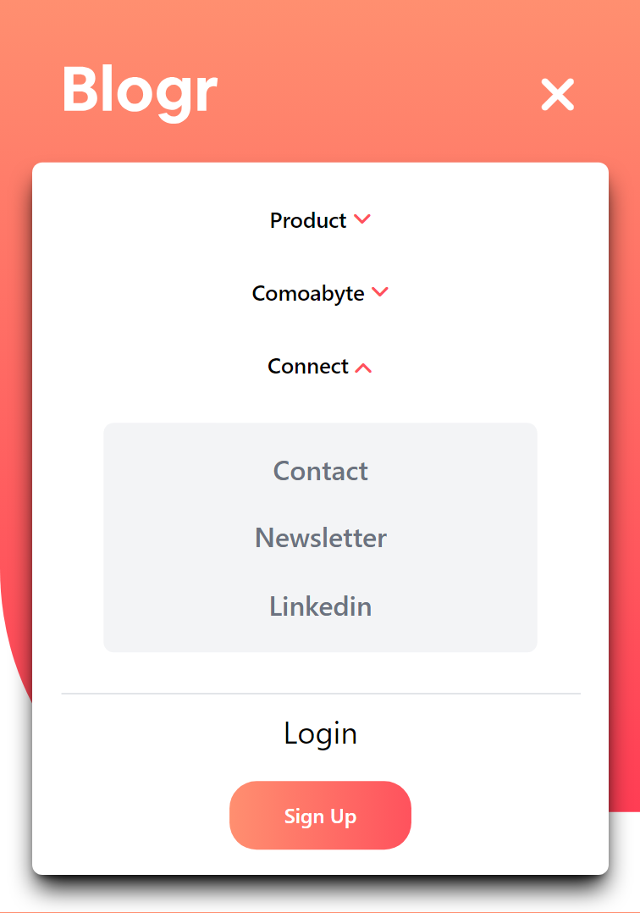
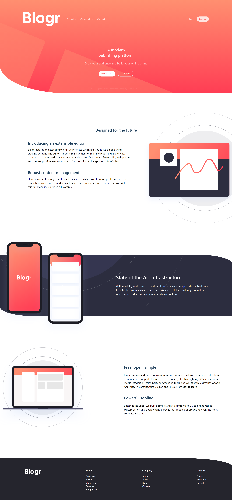
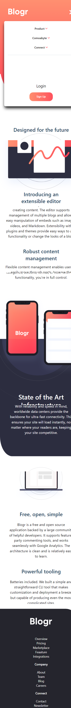
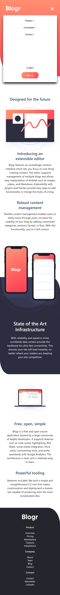
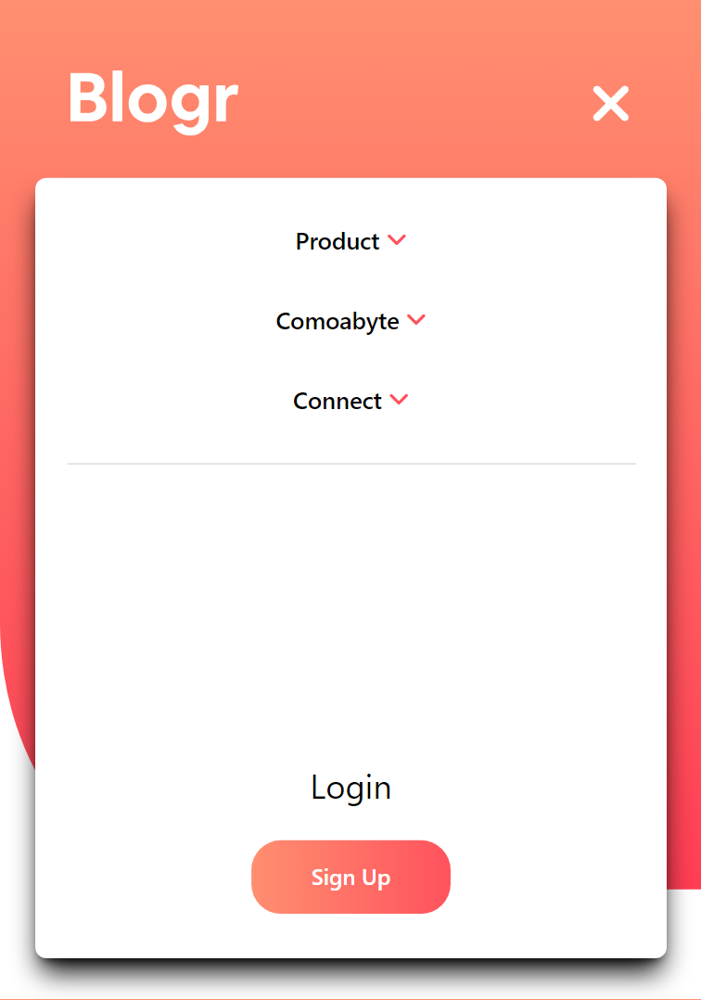

# Frontend Mentor - Blogr landing page solution

This is a solution to the [Blogr landing page challenge on Frontend Mentor](https://www.frontendmentor.io/challenges/blogr-landing-page-EX2RLAApP). Frontend Mentor challenges help you improve your coding skills by building realistic projects. 

### Screenshot

### Links

- Solution URL: [Solucion](https://github.com/Breynersmith/blogr-landing-page.git)
- Live Site URL: [Enlace](https://breynersmith.github.io/blogr-landing-page/)

## My process

### Built with

- Semantic HTML5 markup
- CSS custom properties
- Flexbox
- Mobile-first workflow
- [Vite + Vue 3](https://vitejs.dev/) - Vite + Vue 3
- [TailwindCss](https://tailwindcss.com/) - TailwindCss For styles

## Author

- Frontend Mentor - [@Breynersmith](https://www.frontendmentor.io/profile/Breynersmith)
- Linkedin - [@breyneresmith](https://www.linkedin.com/in/breynerustariz/)
- Facebook - [Breyner Ustariz](https://www.facebook.com/breyner.u)

